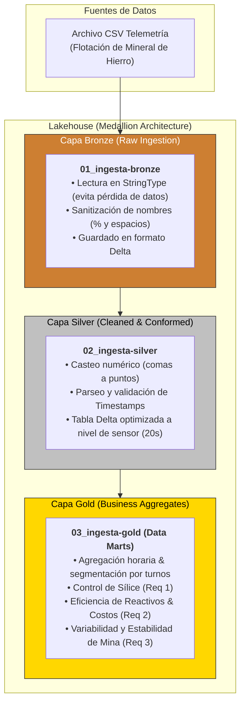

<div align="center">
  
  # Pipeline de Telemetría: Flotación de Mineral de Hierro
  **Arquitectura Lakehouse (Medallion) para Análisis de Telemetría Industrial**
</div>

---

## Resumen del Proyecto

Este repositorio contiene la implementación del pipeline de datos analíticos para el procesamiento de telemetría proveniente del proceso de flotación de mineral de hierro. El sistema adopta una arquitectura Medallion (Lakehouse) desplegada sobre Databricks, procesando los datos desde su extracción cruda hasta la disponibilización de modelos dimensionales para la toma de decisiones ejecutivas.

##Contexto del Dataset

Este conjunto de datos recopila información operativa en tiempo real de una planta de flotación de mineral de hierro, capturada entre marzo y septiembre de 2017 a intervalos de alta frecuencia (cada 20 segundos) combinados con análisis de laboratorio por hora.
Fuente: Quality Prediction in a Mining Process (Kaggle).
Autor: Edvaldo Magalhães.

## Arquitectura del Sistema

El flujo de datos está estructurado en tres capas principales utilizando formato Delta, garantizando la escalabilidad, la integridad de los datos y el rendimiento óptimo para consultas.



## Fases de Procesamiento

### 1. Ingesta Raw (Capa Bronze)
El pipeline inicial (`01_ingesta-bronze`) se encarga de la captura de los archivos CSV generados por los sensores de planta.
* **Preservación de Datos:** Lectura estricta en `StringType` para evitar pérdida de precisión o fallos por tipos de datos inconsistentes desde el origen.
* **Estandarización de Esquema:** Sanitización de nombres de columnas (eliminación de caracteres especiales como `%` y espacios).
* **Almacenamiento:** Escritura en formato Delta con metadatos de linaje.

### 2. Limpieza y Conformación (Capa Silver)
La fase de estandarización (`02_ingesta-silver`) aplica transformaciones técnicas críticas para asegurar la calidad y consistencia del dato.
* **Transformación Numérica:** Reemplazo de separadores decimales (de comas a puntos) y casteo riguroso a formatos numéricos (`Double`, `Integer`).
* **Manejo Temporal:** Parseo y validación de columnas `Timestamp`.
* **Optimización Analítica:** Particionamiento y optimización (Z-Ordering) a nivel de sensor, manejando de forma eficiente la granularidad nativa de 20 segundos.

### 3. Agregados de Negocio (Capa Gold)
La última etapa de procesamiento (`03_ingesta-gold`) consolida la información para dar respuesta a los requerimientos operativos de la gerencia. Se aplican agregaciones de marco temporal (horarias) y lógicas de negocio por turnos de trabajo.

#### Casos de Uso Implementados:
* **[Req 1] Control de Sílice:** El contrato con la fundición exige que el concentrado final tenga menos de 1.5% de Sílice (% Silica Concentrate < 1.5%). Si entregamos más de 1.5%, pagamos multas o nos rechazan el mineral. Necesito saber con precisión cuántas horas al día operamos 'fuera de norma' y en qué momentos exactos ocurren estos fallos.
* 
* **[Req 2] Eficiencia de Reactivos y Costos:** La Amina y el Almidón son nuestros insumos químicos más caros. Sospecho que cuando entra mineral sucio, los operadores inyectan químico a ciegas. Necesito ver la relación entre el consumo promedio por hora de estos reactivos y la pureza de hierro lograda (% Iron Concentrate ≥ 65%), para saber si estamos desperdiciando dinero.
* 
* **[Req 3] Variabilidad y Estabilidad de Mina:** El mineral que viene de la mina varía hora a hora (% Iron Feed). Necesito entender cómo cambia la ley del mineral de entrada hora a hora y si la planta logra estabilizarlo antes de sacarlo como producto final.

## Estructura del Proyecto
El proyecto refleja el flujo de ejecución dentro de Databricks, organizado por las etapas de la arquitectura Medallion:
```text
├── notebooks/
│   ├── 01_ingesta_bronze.py      # Lectura del CSV y guardado en Delta (Raw)
│   ├── 02_ingesta_silver.py      # Casteo, parseo temporal y optimización
│   └── 03_ingesta_gold.py        # Agregaciones horarias y reglas de negocio
├── data/                         # Archivo CSV de muestra de telemetría
└── README.md                     # Documentación principal del repositorio
