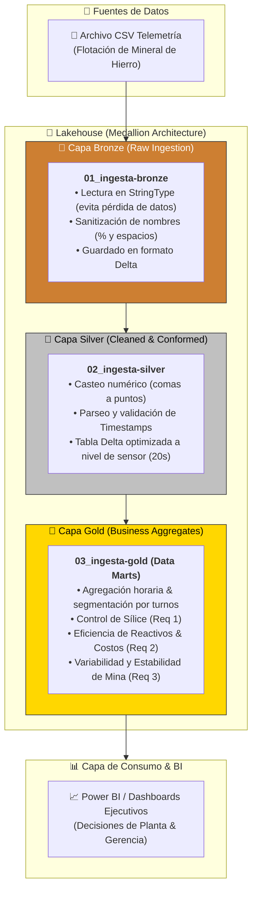

```mermaid
flowchart TD
    subgraph Origen ["📁 Fuentes de Datos"]
        CSV["📄 Archivo CSV Telemetría<br/>(Flotación de Mineral de Hierro)"]
    end

    subgraph Databricks ["🧱 Lakehouse (Medallion Architecture)"]
        direction TB
        
        subgraph Bronze ["🥉 Capa Bronze (Raw Ingestion)"]
            B1["<b>01_ingesta-bronze</b><br/>• Lectura en StringType (evita pérdida de datos)<br/>• Sanitización de nombres (% y espacios)<br/>• Guardado en formato Delta"]
        end

        subgraph Silver ["🥈 Capa Silver (Cleaned & Conformed)"]
            S1["<b>02_ingesta-silver</b><br/>• Casteo numérico (comas a puntos)<br/>• Parseo y validación de Timestamps<br/>• Tabla Delta optimizada a nivel de sensor (20s)"]
        end

        subgraph Gold ["🥇 Capa Gold (Business Aggregates)"]
            G1["<b>03_ingesta-gold (Data Marts)</b><br/>• Agregación horaria & segmentación por turnos<br/>• Control de Sílice (Req 1)<br/>• Eficiencia de Reactivos & Costos (Req 2)<br/>• Variabilidad y Estabilidad de Mina (Req 3)"]
        end

        Bronze --> Silver
        Silver --> Gold
    end

    subgraph Consumo ["📊 Capa de Consumo & BI"]
        BI["📈 Power BI / Dashboards Ejecutivos<br/>(Decisiones de Planta & Gerencia)"]
    end

    CSV --> Bronze
    Gold --> Consumo

    style Bronze fill:#cd7f32,stroke:#333,stroke-width:1px,color:#fff
    style Silver fill:#c0c0c0,stroke:#333,stroke-width:1px,color:#000
    style Gold fill:#ffd700,stroke:#333,stroke-width:1px,color:#000
```
