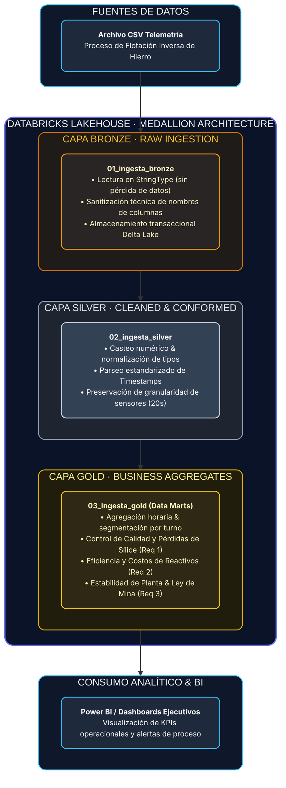

```mermaid
flowchart TD
    %% Nodos de Origen
    subgraph Origen ["FUENTES DE DATOS"]
        CSV["<b>Archivo CSV Telemetría</b><br/>Proceso de Flotación Inversa de Hierro"]
    end

    %% Nodos de Lakehouse Databricks
    subgraph Lakehouse ["DATABRICKS LAKEHOUSE · MEDALLION ARCHITECTURE"]
        direction TB
        
        subgraph Bronze ["CAPA BRONZE · RAW INGESTION"]
            B1["<b>01_ingesta_bronze</b><br/>• Lectura en StringType (sin pérdida de datos)<br/>• Sanitización técnica de nombres de columnas<br/>• Almacenamiento transaccional Delta Lake"]
        end

        subgraph Silver ["CAPA SILVER · CLEANED & CONFORMED"]
            S1["<b>02_ingesta_silver</b><br/>• Casteo numérico & normalización de tipos<br/>• Parseo estandarizado de Timestamps<br/>• Preservación de granularidad de sensores (20s)"]
        end

        subgraph Gold ["CAPA GOLD · BUSINESS AGGREGATES"]
            G1["<b>03_ingesta_gold (Data Marts)</b><br/>• Agregación horaria & segmentación por turno<br/>• Control de Calidad y Pérdidas de Sílice (Req 1)<br/>• Eficiencia y Costos de Reactivos (Req 2)<br/>• Estabilidad de Planta & Ley de Mina (Req 3)"]
        end

        Bronze --> Silver
        Silver --> Gold
    end

    %% Nodos de Consumo
    subgraph Consumo ["CONSUMO ANALÍTICO & BI"]
        BI["<b>Power BI / Dashboards Ejecutivos</b><br/>Visualización de KPIs operacionales y alertas de proceso"]
    end

    CSV --> Bronze
    Gold --> Consumo

    %% Estilos Globales: Paleta Modern Tech (Dark Slate / Bronze / Silver / Gold)
    classDef default font-family:Inter,Segoe UI,Arial,sans-serif,font-size:12px;

    %% Contenedores Principales
    style Origen fill:#0f172a,stroke:#38bdf8,stroke-width:1.5px,color:#f8fafc,rx:12,ry:12
    style Lakehouse fill:#0b1329,stroke:#6366f1,stroke-width:2px,color:#f8fafc,rx:14,ry:14
    style Consumo fill:#0f172a,stroke:#38bdf8,stroke-width:1.5px,color:#f8fafc,rx:12,ry:12

    %% Capas Medallion (Contenedores)
    style Bronze fill:#1e1b18,stroke:#d97706,stroke-width:1.5px,color:#fbbf24,rx:10,ry:10
    style Silver fill:#1e2430,stroke:#94a3b8,stroke-width:1.5px,color:#e2e8f0,rx:10,ry:10
    style Gold fill:#201d0d,stroke:#eab308,stroke-width:1.5px,color:#fef08a,rx:10,ry:10

    %% Nodos Internos (Tarjetas uniformes con alto contraste)
    style CSV fill:#1e293b,stroke:#38bdf8,stroke-width:1.5px,color:#f8fafc,rx:8,ry:8
    style B1 fill:#292524,stroke:#f59e0b,stroke-width:1.5px,color:#fef3c7,rx:8,ry:8
    style S1 fill:#334155,stroke:#cbd5e1,stroke-width:1.5px,color:#ffffff,rx:8,ry:8
    style G1 fill:#2e2814,stroke:#facc15,stroke-width:1.5px,color:#fef9c3,rx:8,ry:8
    style BI fill:#1e293b,stroke:#38bdf8,stroke-width:1.5px,color:#f8fafc,rx:8,ry:8
```
