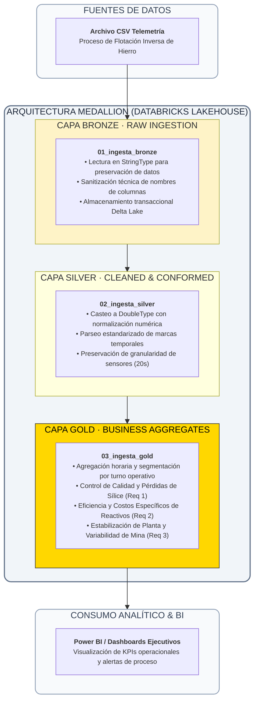

```mermaid
flowchart TD
    %% Nodos de Origen
    subgraph Origen ["FUENTES DE DATOS"]
        CSV["<b>Archivo CSV Telemetría</b><br/>Proceso de Flotación Inversa de Hierro"]
    end

    %% Nodos de Lakehouse Databricks
    subgraph Lakehouse ["ARQUITECTURA MEDALLION (DATABRICKS LAKEHOUSE)"]
        direction TB
        
        subgraph Bronze ["CAPA BRONZE · RAW INGESTION"]
            B1["<b>01_ingesta_bronze</b><br/>• Lectura en StringType para preservación de datos<br/>• Sanitización técnica de nombres de columnas<br/>• Almacenamiento transaccional Delta Lake"]
        end

        subgraph Silver ["CAPA SILVER · CLEANED & CONFORMED"]
            S1["<b>02_ingesta_silver</b><br/>• Casteo a DoubleType con normalización numérica<br/>• Parseo estandarizado de marcas temporales<br/>• Preservación de granularidad de sensores (20s)"]
        end

        subgraph Gold ["CAPA GOLD · BUSINESS AGGREGATES"]
            G1["<b>03_ingesta_gold</b><br/>• Agregación horaria y segmentación por turno operativo<br/>• Control de Calidad y Pérdidas de Sílice (Req 1)<br/>• Eficiencia y Costos Específicos de Reactivos (Req 2)<br/>• Estabilización de Planta y Variabilidad de Mina (Req 3)"]
        end

        Bronze --> Silver
        Silver --> Gold
    end

    %% Nodos de Consumo
    subgraph Consumo ["CONSUMO ANALÍTICO & BI"]
        BI["<b>Power BI / Dashboards Ejecutivos</b><br/>Visualización de KPIs operacionales y alertas de proceso"]
    end

    CSV --> Bronze
    Gold --> Consumo

    %% Estilos Globales y Uniformes (Bordes redondeados y paleta sobria)
    classDef default font-family:Arial,sans-serif,font-size:12px;
    
    style Origen fill:#f8fafc,stroke:#94a3b8,stroke-width:1.5px,color:#334155,rx:10,ry:10
    style Lakehouse fill:#f1f5f9,stroke:#64748b,stroke-width:2px,color:#1e293b,rx:12,ry:12
    style Consumo fill:#f8fafc,stroke:#94a3b8,stroke-width:1.5px,color:#334155,rx:10,ry:10

    style Bronze fill:#fef3c7,stroke:#d
    style Gold fill:#ffd700,stroke:#333,stroke-width:1px,color:#000
```
